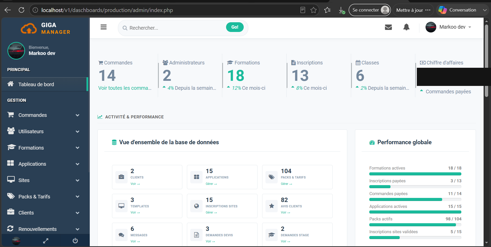
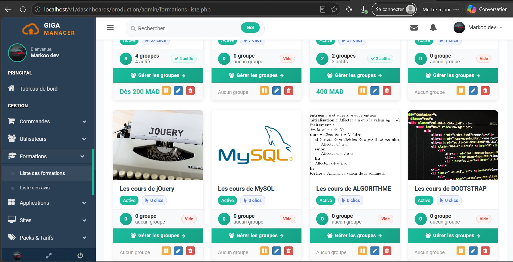
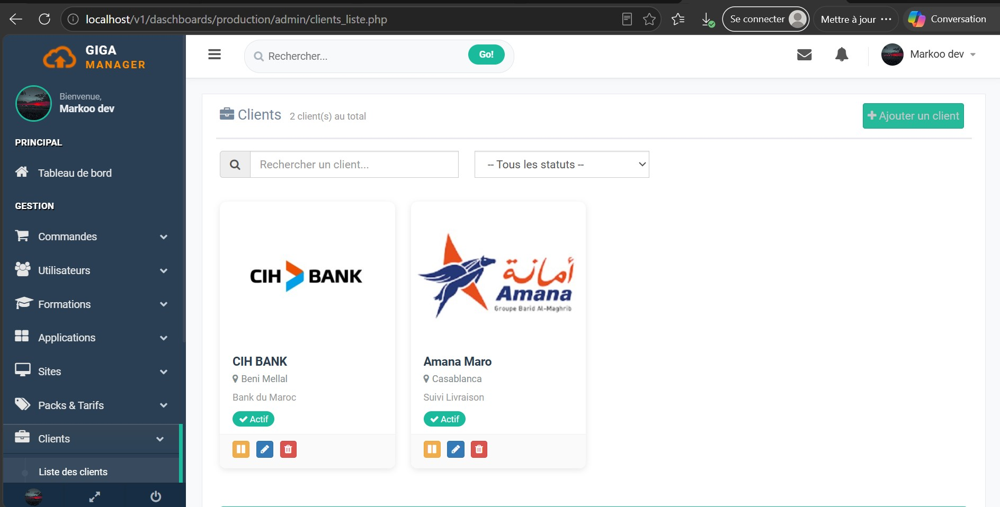
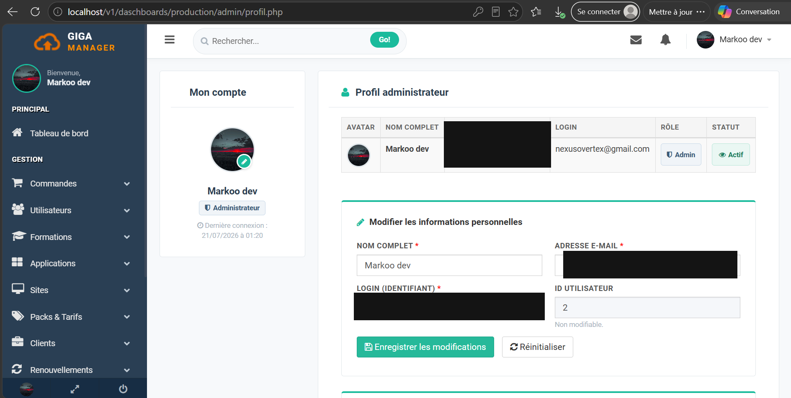
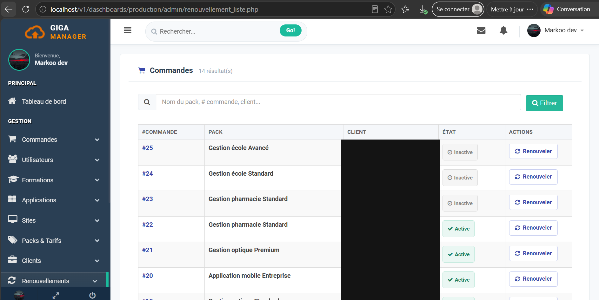
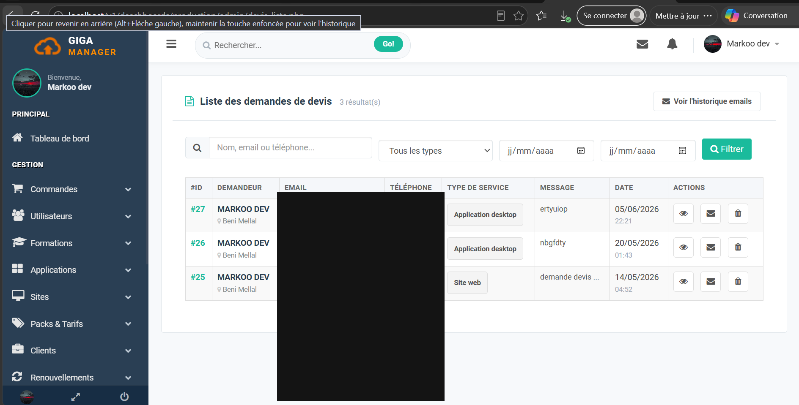
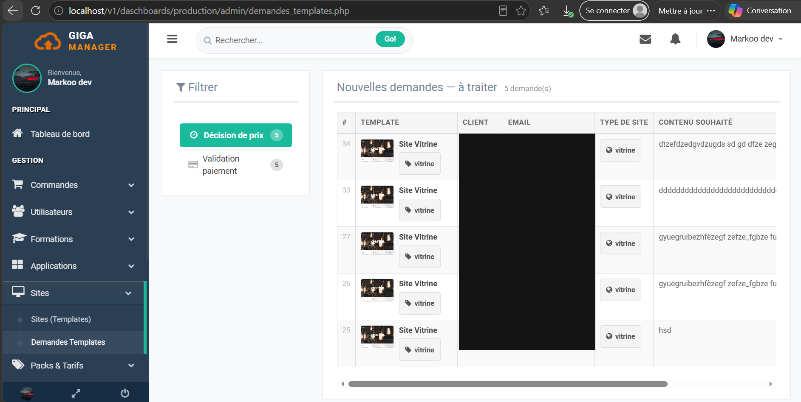
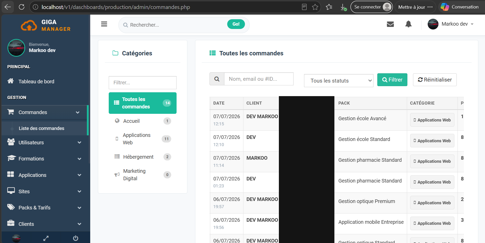
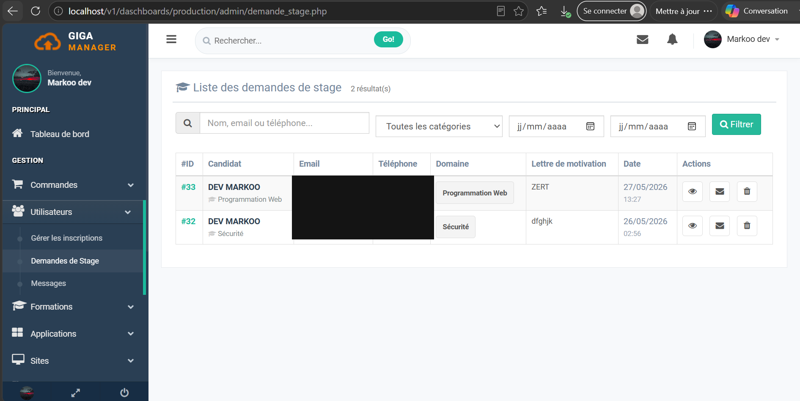

# Giga Manager – Admin Dashboard

<h1 align="center">
  
</h1>

This project was developed during my internship at **Giga Manager** (Béni Mellal, Morocco), a company providing web hosting and website development services.

⚠️ **Note:** For confidentiality reasons, the source code of this project is not publicly available. This repository only contains a project overview and screenshots to document the work carried out.

---

## 📸 Screenshots

<table width="100%">
  <tr>
    <td width="33%"></td>
    <td width="33%"></td>
    <td width="33%"></td>
  </tr>
  <tr>
    <td width="33%"></td>
    <td width="33%"></td>
    <td width="33%"></td>
  </tr>
  <tr>
    <td width="33%"></td>
    <td width="33%"></td>
    <td width="33%"></td>
  </tr>
</table>

👉 **[View all screenshots](./screenshots)**

---

## 🎯 Project Overview

During this internship, I developed an **admin dashboard** to manage:
- The official **Giga Manager** website (gigamanager.com)
- User registrations for hosting services, web applications, and training programs
- Content updates on several pages of the company website

I also directly modified and updated some pages of the live company website as part of this project.

---

## 🛠️ Technologies Used
- HTML / CSS / JavaScript
- PHP
- MySQL
- Git & GitHub

*(adapte cette liste selon ce que tu as réellement utilisé)*

---

## Hinweis
Dieses Projekt wurde im Rahmen eines Praktikums bei Giga Manager entwickelt. Aus Vertraulichkeitsgründen wird hier ausschließlich eine Projektübersicht mit Screenshots bereitgestellt, ohne Veröffentlichung des Quellcodes.

Der Fokus liegt auf der Demonstration meiner praktischen Erfahrung in der Entwicklung von Admin-Dashboards, Datenbankverwaltung und Webentwicklung im professionellen Kontext.

---

## 👤 Author
- GitHub : [@Nexus-Vertex](https://github.com/Nexus-Vertex)
- Email : leilaeltousy@gmail.com

---
## 📝 License
This project overview is shared for portfolio purposes only. Source code remains property of Giga Manager.
